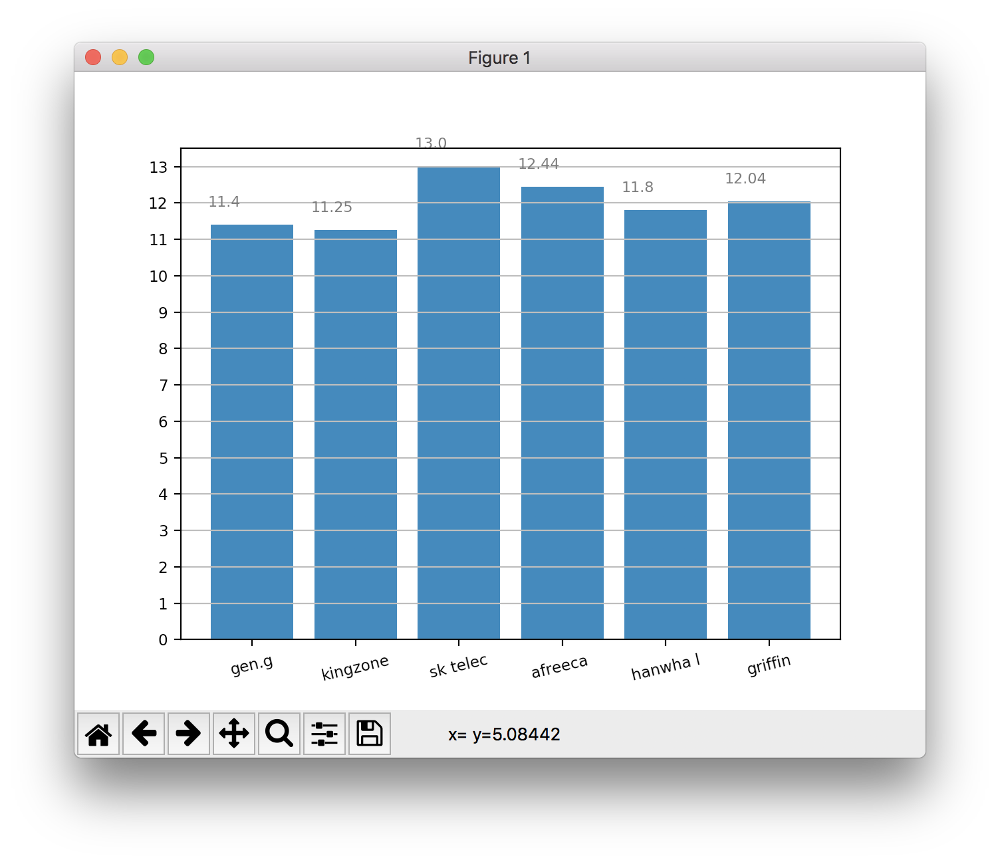
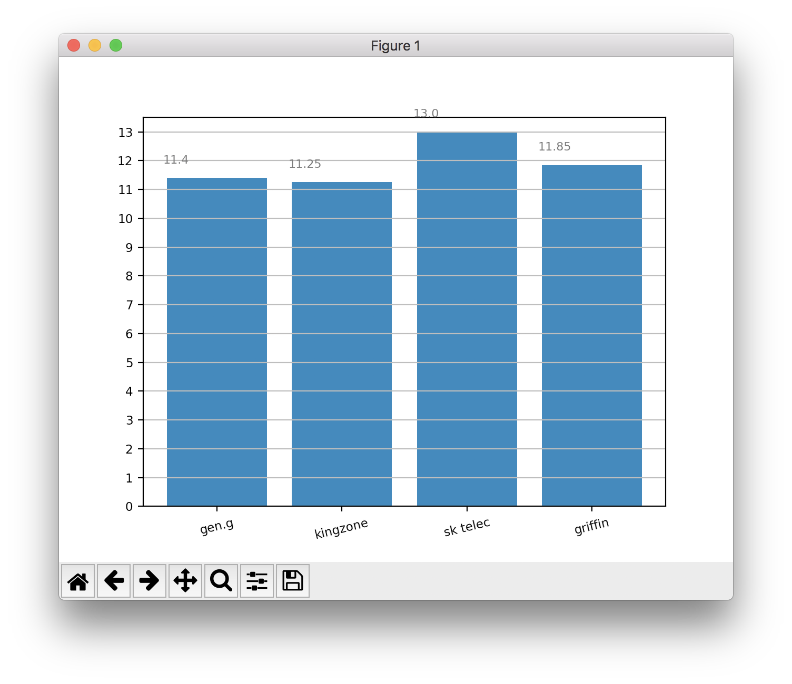
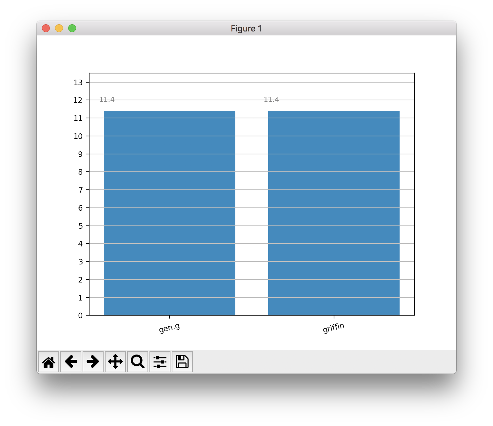

## Exploring New Markets - Total Towers

Until recently, I have mainly focused on the "first" markets - first blood, first tower, first dragon and first baron. I have had the most success and profits with first blood and first tower - first dragon is not consistent, outside of a handful of teams and junglers (Team Liquid's Xmithie and Vitality's Kikis come to mind as junglers with very high first dragon secures). 

Betting on first baron is similar to betting on the winner of a game, since the correlation between securing the first baron and eventual victory is so high (around 70% of first barons lead to victories in NA/EU, and even higher in the LCK). As such, the odds are usually low and don't provide much profit.

I'm looking to work on a new model aimed at predicting the "total" markets, namely "total kills over/under" and "total towers destroyed over/under". 

I'll focus on the total towers destroyed for this article. Some games are bloody, and some are not - there is no requirement for a number of kills to win or lose a game. When it comes to turrets, however, a certain number must be destroyed, which makes the market easier to analyze and model. The minimum towers to destroy to win the game is 5. This is uncommon. 10-15 is a more reasonable total. The next professional match is a BoF series with Gen.G vs Griffin in the LCK regional qualifiers. Let's take a look at the league as a whole and work towards an estimate for the number of towers destroyed - above or under 12.5.

## The Data

Since we are in the regional playoffs, I only want to consider the teams around that level - so the top 6 teams in the league. This removes the bias introduced by higher level teams stomping lower level ones, which leads to less towers taken in general. First the raw data, using a script that pulls all games Griffin played during the summer split, and any other opponent in the top 5 of the league. The 'above' column is whether or not a combined 12.5 towers were destroyed or not.

id  |  index  |  team     |  opponent             |  teamtowerkills  |  opptowerkills  |  towerkills  |  above
----|---------|-----------|-----------------------|------------------|-----------------|--------------|-------
0   |  0      |  griffin  |  hanwha life esports  |  2.0             |  10.0           |  12.0        |  False
1   |  1      |  griffin  |  hanwha life esports  |  7.0             |  7.0            |  14.0        |  True
2   |  2      |  griffin  |  hanwha life esports  |  11.0            |  1.0            |  12.0        |  False
3   |  12     |  griffin  |  kingzone dragonx     |  9.0             |  1.0            |  10.0        |  False
4   |  13     |  griffin  |  kingzone dragonx     |  8.0             |  1.0            |  9.0         |  False
5   |  14     |  griffin  |  kt rolster           |  1.0             |  8.0            |  9.0         |  False
6   |  15     |  griffin  |  kt rolster           |  4.0             |  10.0           |  14.0        |  True
7   |  16     |  griffin  |  afreeca freecs       |  8.0             |  1.0            |  9.0         |  False
8   |  17     |  griffin  |  afreeca freecs       |  11.0            |  5.0            |  16.0        |  True
9   |  18     |  griffin  |  gen.g                |  7.0             |  1.0            |  8.0         |  False
10  |  19     |  griffin  |  gen.g                |  1.0             |  10.0           |  11.0        |  False
11  |  20     |  griffin  |  gen.g                |  11.0            |  0.0            |  11.0        |  False
12  |  21     |  griffin  |  afreeca freecs       |  0.0             |  10.0           |  10.0        |  False
13  |  22     |  griffin  |  afreeca freecs       |  1.0             |  10.0           |  11.0        |  False
14  |  23     |  griffin  |  hanwha life esports  |  9.0             |  1.0            |  10.0        |  False
15  |  24     |  griffin  |  hanwha life esports  |  11.0            |  0.0            |  11.0        |  False
16  |  25     |  griffin  |  kt rolster           |  7.0             |  11.0           |  18.0        |  True
17  |  26     |  griffin  |  kt rolster           |  9.0             |  2.0            |  11.0        |  False
18  |  27     |  griffin  |  kt rolster           |  2.0             |  11.0           |  13.0        |  True
19  |  28     |  griffin  |  kingzone dragonx     |  9.0             |  5.0            |  14.0        |  True
20  |  29     |  griffin  |  kingzone dragonx     |  11.0            |  1.0            |  12.0        |  False
21  |  30     |  griffin  |  gen.g                |  1.0             |  9.0            |  10.0        |  False
22  |  31     |  griffin  |  gen.g                |  6.0             |  11.0           |  17.0        |  True
23  |  41     |  griffin  |  afreeca freecs       |  10.0            |  5.0            |  15.0        |  True
24  |  42     |  griffin  |  afreeca freecs       |  3.0             |  11.0           |  14.0        |  True
25  |  43     |  griffin  |  afreeca freecs       |  2.0             |  11.0           |  13.0        |  True
26  |  44     |  griffin  |  afreeca freecs       |  11.0            |  0.0            |  11.0        |  False
27  |  45     |  griffin  |  afreeca freecs       |  6.0             |  7.0            |  13.0        |  True

Adding everything up, we get:

- Games above 12.5 towers: 11 (40%)
- Games below 12.5 towers: 17 (60%)

Let's visualize this data on a bar graph, to get a better feel for it:

The y axis represents the average number of towers destroyed in each team's games.

Or, 39% vs 61%. Out of those six teams, only four others are present in the regional gauntlet: SKT, Griffin, Gen.G and Kingzone. Performing the same analysis again, only including those teams we end up with: 

 id |  index  |  team     |  opponent          |  teamtowerkills  |  opptowerkills  |  towerkills  |  above
----|---------|-----------|--------------------|------------------|-----------------|--------------|-------
0   |  10     |  griffin  |  sk telecom t1     |  7.0             |  10.0           |  17.0        |  True
1   |  11     |  griffin  |  sk telecom t1     |  9.0             |  1.0            |  10.0        |  False
2   |  12     |  griffin  |  kingzone dragonx  |  9.0             |  1.0            |  10.0        |  False
3   |  13     |  griffin  |  kingzone dragonx  |  8.0             |  1.0            |  9.0         |  False
4   |  18     |  griffin  |  gen.g             |  7.0             |  1.0            |  8.0         |  False
5   |  19     |  griffin  |  gen.g             |  1.0             |  10.0           |  11.0        |  False
6   |  20     |  griffin  |  gen.g             |  11.0            |  0.0            |  11.0        |  False
7   |  28     |  griffin  |  kingzone dragonx  |  9.0             |  5.0            |  14.0        |  True
8   |  29     |  griffin  |  kingzone dragonx  |  11.0            |  1.0            |  12.0        |  False
9   |  30     |  griffin  |  gen.g             |  1.0             |  9.0            |  10.0        |  False
10  |  31     |  griffin  |  gen.g             |  6.0             |  11.0           |  17.0        |  True
11  |  37     |  griffin  |  sk telecom t1     |  9.0             |  2.0            |  11.0        |  False
12  |  38     |  griffin  |  sk telecom t1     |  8.0             |  6.0            |  14.0        |  True

- Games above 12.5 towers: 4/13 (30%)
- Games below 12.5 towers: 9/13 (70%)

The percentage change is mainly due to excluding KT, who have a fairly high average tower kill count in their games. The numbers are suddenly a lot closer as well. There are a number of reasons that could explain this - at high level play, especially in the LCK region, teams are much better at capitalizing on an advantage. Often Several turrets will lead to a quick and timely demise. I'll do an analysis regarding this, and comparing other regions, in a future article.

Now onto the bets! Different websites are offering different odds on the above/under 12.5 towers market, but most are around:

- Above 12.5 turrets - 2.1
- Under 12.5 turrets - 1.66

If we do the same analysis once again, just with Gen.G and Griffin, we get:

 id  |  index  |  team     |  opponent  |  teamtowerkills  |  opptowerkills  |  towerkills  |  above
---|---------|-----------|------------|------------------|-----------------|--------------|-------
0  |  18     |  griffin  |  gen.g     |  7.0             |  1.0            |  8.0         |  False
1  |  19     |  griffin  |  gen.g     |  1.0             |  10.0           |  11.0        |  False
2  |  20     |  griffin  |  gen.g     |  11.0            |  0.0            |  11.0        |  False
3  |  30     |  griffin  |  gen.g     |  1.0             |  9.0            |  10.0        |  False
4  |  31     |  griffin  |  gen.g     |  6.0             |  11.0           |  17.0        |  True

- Games above 12.5 tower - 1/5 (20%)
- Games below 12.5 tower - 4/5 (80%)

4/5 chance looks good. This is a very small sample size, though. Still, this leaves us with:

- Top 6 teams: 60% below 12.5 towers (28 match sample)
- The 4 teams in the regionals qualifier: 70% below 12.5 towers (13 match sample)
- Gen.G vs Griffin: 80% (5 match sample)

Coming back to the odds - 1.66 (under 12.5) vs 2.1 (over 12.5). The approx estimated values come out at:

< 12.5 towers | Odds | EV
---- | ---- | -------
60% | 1.66     | 0.99
70% | 1.66     | 1.16
80% | 1.66     | 1.32

A more focused analysis can reveal more accurate odds that the bookeepers project. 

This is my first time doing an analysis on the totals market. I'll post the results when they come out, and look to do a similar analysis for total kills in other leagues, such as NA and EU. I do not expect to win every bet at first, but work on the model and improve my analysis. I'll certainly be going for this bet on Friday though! Results along with my other bets will be in an article next week, and the usual analysis.
